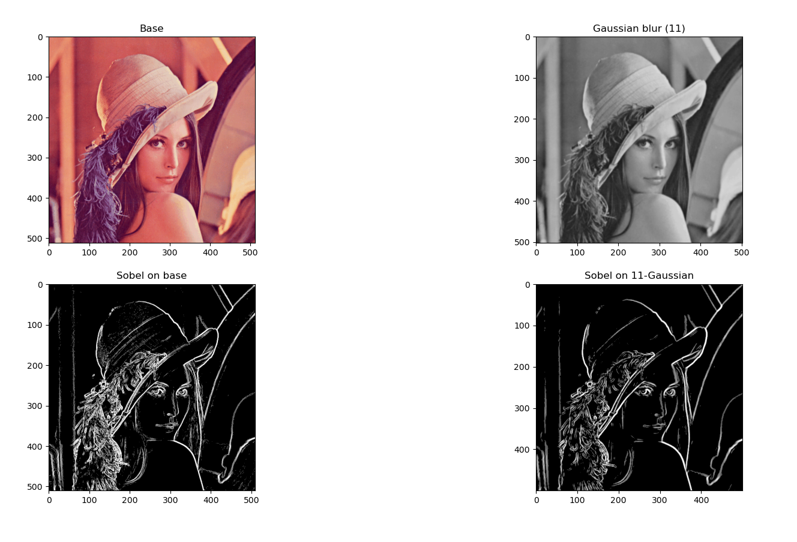
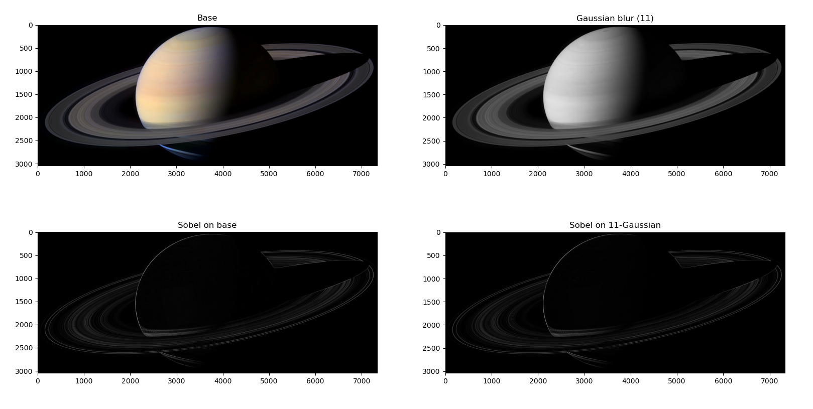

# Image Processing Playground

## Usage  

This script uses the libraries [numba](https://numba.pydata.org/numba-doc/latest/user/installing.html), matplotlib and numpy.
  
Run 'run_test.py' in the cmd line as such:  
> `python run_test.py <image_path> <threshold>`

This will print out the time taken by each filter, then plot the 4 images side by side (base image, gaussian image, sobel filter applied on base image and on sobel filterred image).  

Threshold is a value between 0 and 255: every value below the threshold will be set to 0 (black).  

Another parameter for the Gaussian Blur is the sigma value, that you can change in [image_process.py](image_process.py) > gaussian_blur()
## Results:
  
* Result on a portrait (threshold: 70):  

  
* Result on a high res picture of Saturn:  

